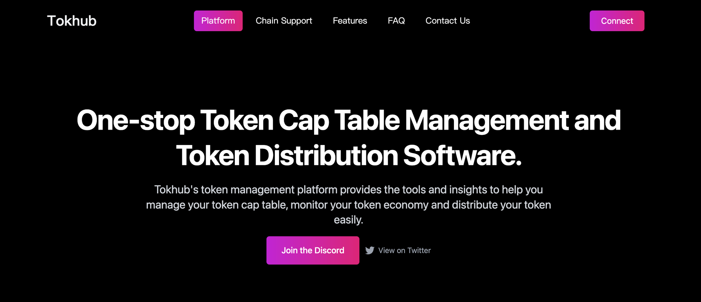
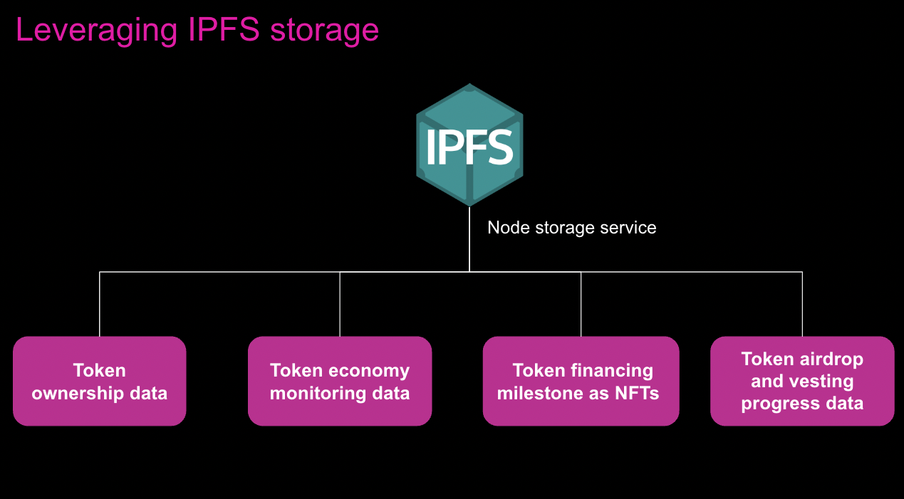

### 1. What is your project? (max 100 words)
<!-- Description of your project built with Filecoin or closely related technologies (libp2p, ipfs, ipld, OrbitDB, Textile, NFT.storage, Web3.storage, Estuary, etc.) -->

<!-- Link to public Github repo -->
<!-- Link to demo or website, if applicable -->

Our project is Tokhub, aiming to be the Carta for web3.
**Tokhub's token management and distribution platform** provides the tools and insights to help you manage your token cap table, monitor your token economy and distribute your token easily.

**1.Plan your token from 0 to 1**: With the help of Tokhub, you can plan and monitor your token economic system (including token supply, token demand, token distribution and token vesting, etc).

**2.Automating your token management and distribution**: helping crypto founders and crypto investors to track and claim their token through our dashboards(ownership percentage, vesting schedule progress, etc.), and to distribute tokens automatically through our smart contracts.

**3.Employment incentive and compliance with token**: Design you employment token incentives, manage your token offer letters, legal agreements (SAFTs, token warrants, token grants) and keep compliant under regulation scrutiny.

Github repo: https://github.com/Tokhub-Carta-for-Web3-0

Demo: https://www.loom.com/share/f3ce8739dd0e4f7ab6c067ecd10e5cbd

Notion: https://www.notion.so/Tokhub-Carta-for-Web3-41074f2cda714006bb7441159cace007

### 2. How will IPFS, Filecoin, or related technology be used for this project? (max 100 words)

We will use IPFS nodes to store our data relating to tokens. The scope of our data for IPFS storage includes:

1) Token ownership data: the percentage ownerhships of token for key stakeholders(founders, employee, investors, community, treasury, ecosystem, etc),  with different access levels for different groups of users.
2) Token economy monitoring data: evolving and scientific metrics for token economy such as: token max supply, total circulating token, token prices, token circulating velocities, etc.
3) Token financing milestone as NFTs: key financing milestone will be minted as NFT, distributed to investors, management team and financial advisory, and stored at IPFS.
4) Token airdrop and vesting progress data: Data around token distribution, vesting, transaction and payment can also be stored at IPFS.  

  
### 3. How will you improve your project with this grant? What steps will you take to meet this objective? (max 200 words)
<!-- Clear and concise description of the planned next step(s) or improvements for which you are seeking grant support -->
Use of grants:
1) Receiving the grant can empower us to attract better engineers to join our team, we currently need more chain developer to help us reach more public chain ecosystem: Ethereum, Polygon, Aptos, Sui, Polkadot, etc.

2) The grant can also let us allocate some resouece to marketing efforts: token design and management workshop, community building, and marketing campaign to improve our brand awareness.

Steps to meet the objectives:
1) Further develop our product and prepare for a public launch. The feature we want to incorporate into our public launch includes: 

/Token Management/

- Company information: company onboard by filling in information such as: company name, legal name, state of incorporation, address, signatories, board members, etc.
- Token ownership: track token ownership, monitor token economy and vesting progress, etc.
- Token distribution: airdrop, investor and employee, etc.(strongly related to crypto payments)
- Compliance: SAFTS, token offer letter templates, tax issues, etc.

/Token Distribution/

- Airdrop: distribute tokens to multiple wallet addresses in one click
- Investor Vesting Schedule: distribute tokens to different investors according to customized vesting schedule
- Employee Vesting Schedule: distribute tokens to employee according to customized token option agreement

2) Promiting to web3 projects across different public chains and web3 investors: crypto projects like defi/gamefi/socialfi, and crypto investors like a16z, pantera, sequoia, etc.
 
### 4. Is this project open source?
<!-- MIT, APACHE2, or GPL license for code or [CC-BY-SA 3.0](https://ipfs.io/ipfs/QmVreNvKsQmQZ83T86cWSjPu2vR3yZHGPm5jnxFuunEB9u) license for content must be applied to the current project and all work funded via this microgrant. -->

Our on-chain contract for token distribution (airdrop/investor vesting schedule/employee vesting schedule, etc)is open sourced to web3 companies.

### 5. Do you agree to share grant reports upon request, including a final grant report at the end of the three month period?
<!-- Report content may include progress or results of your microgrant-funded work, any Filecoin technical or usage guidance requests, and a description of your experience building on Filecoin, including any challenges or shortcomings encountered. -->

Yes, we will provide the report regarding the progress of our project, either upon request or at the final stage.
  
### 6. Does your proposal comply with our Community Code of Conduct?
<!-- Please read the [Filecoin Code of Conduct](https://github.com/filecoin-project/community/blob/master/CODE_OF_CONDUCT.md) and make sure your project is in compliance -->

Yes, our proposal comply with community code of conduct.

### 7. Links and submissions
* If your project began at a hackathon, have you submitted it for the relevant Protocol Labs prizes? Include links here if available:
Our project started at Antalpha Hacker House, we successfully finished this event and our project was presented at demo day.

Demoday Presentation: https://www.notion.so/Tokhub-Carta-for-Web3-41074f2cda714006bb7441159cace007
  
### Additional questions:
* For each team member(s), please list name, email, Github account, and role in the project.

-Troy, Founder, Alibaba and Bytedance strategy/EF Founder in Residence, Tsinghua University (yanweicheng75@163.com, https://github.com/troyrocket, code contributor)

-Murph, Co-founder, VC investors and in-coming Bytedance engineer（Volcengine, 火山引擎), Tsinghua University (2210454731@qq.com, https://github.com/jw-liu2000, code contributor)

-Walter, Co-founder Apple & Amazon engineer, Zhejiang University (taguo92@gmail.com, https://github.com/walterguo, code contributor)

-Alan, Engineer, Contract engineer, Hacker in Antalpha Hacker House (https://github.com/yidongw, code contributor)

-Pengcheng, Engineer, Contract engineer, Hacker in Antalpha Hacker House (https://github.com/AMARAjustone, code contributor)

-Li Jun, Engineer, Contract engineer, Hacker in Defi Space (https://github.com/2012029301, code contributor)

* How did you learn about our microgrant program?
I learned about this microgrant program through the promotion of protocol labs at Antalpha Hacker House.

* If your project was created as part of an event or hackathon:
  * What was the name of the event? (e.g. ETHGlobal NFTHack, Cal Hacks hello:world, Chainlink, CivHacks, GameDevJ, ETHGlobal Scaling Ethereum)
  * Please link to your hackathon submission

  Our project started at Antalpha Hacker House, we successfully finished its product development cycle and our project was presented at demo day.
  
  Demoday Presentation: https://www.notion.so/Tokhub-Carta-for-Web3-41074f2cda714006bb7441159cace007
